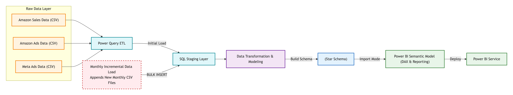
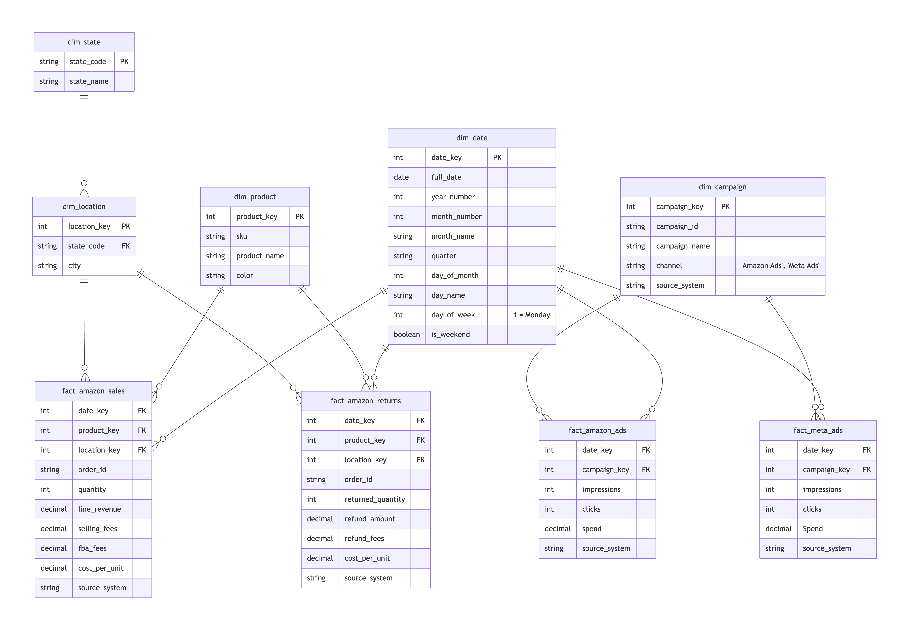
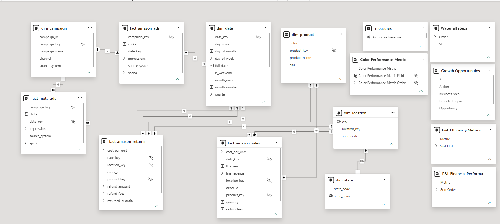
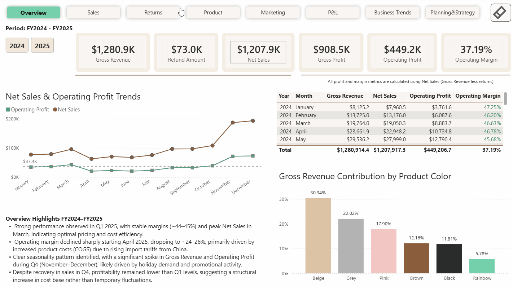
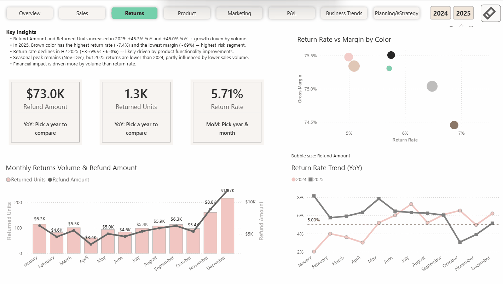
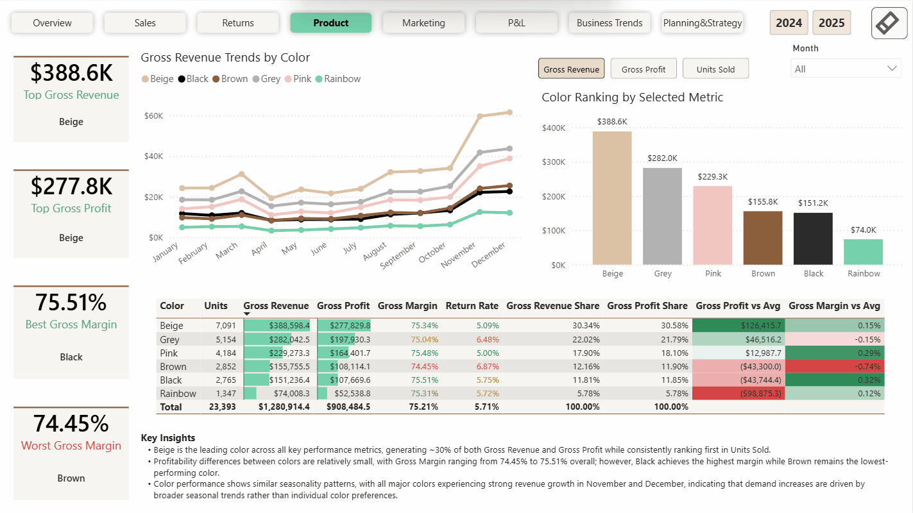
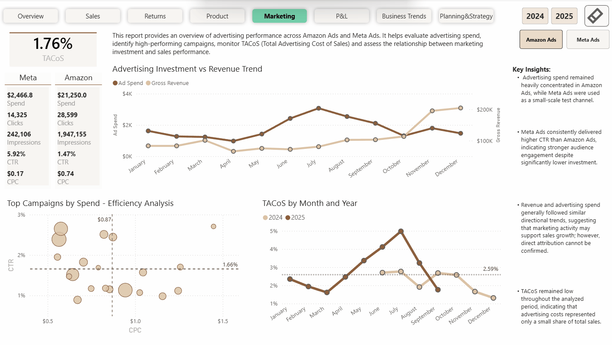
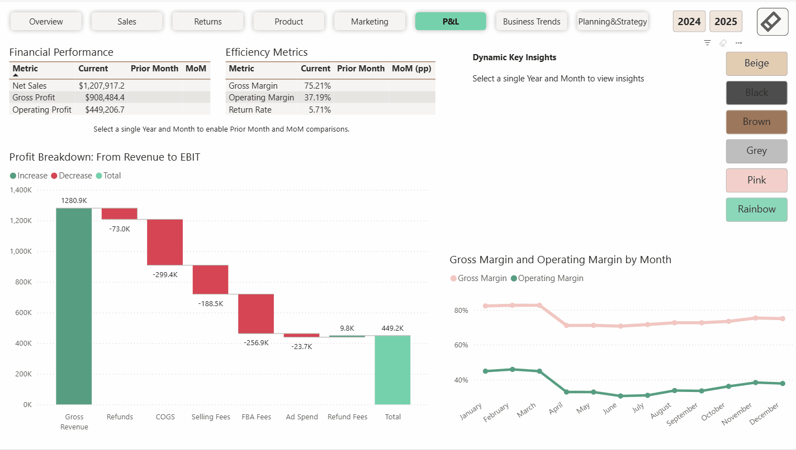
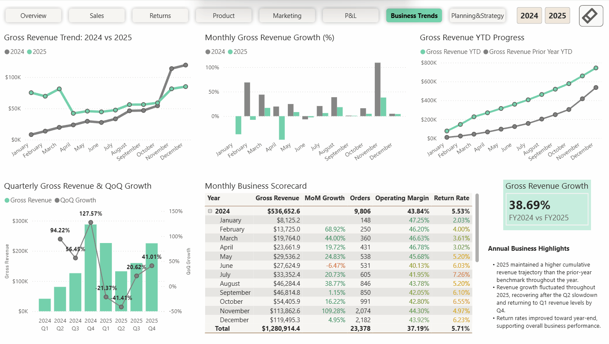
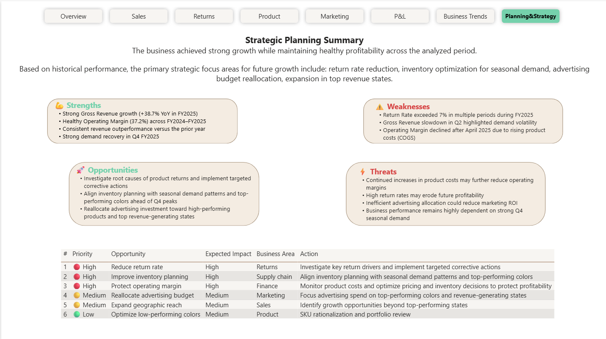

# Amazon Seller Growth & Profitability Analytics

## Project Overview
This project presents an end-to-end Business Intelligence solution designed to transform raw ecommerce sales, returns, and advertising data into actionable business insights through ETL, SQL staging, Hybrid Star Schema modeling, DAX analytics, performance optimization, and Power BI Service deployment.

The solution analyzes sales performance, profitability, marketing efficiency, product performance, return management, and strategic growth opportunities across FY2024–FY2025.

## Business Context
An Amazon-based ecommerce business generated sales, returns, and advertising data across multiple operational systems and exports.

The business lacked a centralized reporting solution, making it difficult to obtain a complete view of sales performance, profitability, marketing efficiency, product performance, and return activity.

To support data-driven decision-making, the business required a unified analytics platform capable of consolidating data from multiple sources and providing both operational and strategic insights using FY2024–FY2025 data.

## Project Objectives
The objective of this project was to design and develop an end-to-end Business Intelligence solution that transforms raw ecommerce data into actionable business insights.

### Business Focus Areas
- Revenue Growth
- Profitability Analysis
- Marketing Performance
- Return Management
- Product Optimization
- Strategic Planning

### Key Objectives
- Consolidate sales, returns, and advertising data into a centralized reporting solution.
- Build a scalable Hybrid Star Schema model for analytical reporting.
- Develop reusable DAX measures for KPI tracking and business analysis.
- Analyze sales performance and revenue trends across FY2024–FY2025.
- Monitor profitability using Net Sales, Gross Profit, Operating Profit, and margin metrics.
- Evaluate advertising efficiency across Amazon Ads and Meta Ads.
- Track return activity and measure its impact on profitability.
- Identify top-performing and underperforming products.
- Analyze business trends using YoY, MoM, QoQ, and YTD calculations.
- Deliver strategic insights and recommendations to support business growth and profitability.

## Business Questions Addressed
The solution was designed to answer key business questions relevant to ecommerce performance, profitability, and growth.

| Business Question | Solution |
|-------------------|-----------|
| How profitable is the business after all expenses? | Built a P&L framework incorporating revenue, returns, product costs, Amazon fees, and advertising expenses. |
| Which products contribute the most revenue and profit? | Performed product-level revenue, gross profit, margin, and contribution analysis. |
| How do returns impact overall business performance? | Measured return rates, refund amounts, and their effect on profitability. |
| How effective is advertising spend across channels? | Evaluated CTR, CPC, Total Ad Spend, and TACoS across Amazon Ads and Meta Ads. |
| How do seasonality and business trends impact performance? | Analyzed revenue and profitability using YoY, MoM, QoQ, and YTD metrics. |
| Which products and business areas require optimization? | Identified low-performing products, high return rates, and profitability risks. |
| Where are the biggest opportunities for future growth? | Developed SWOT analysis, growth opportunities, and strategic recommendations. |
| How can executives monitor business performance in one place? | Built a centralized BI dashboard integrating sales, marketing, returns, product, and financial analytics. |

## Skills Demonstrated
### Data Engineering & Modeling
- Power Query ETL
- SQL Data Transformation
- Data Modeling
- Hybrid Star Schema Design

### Business Intelligence & Analytics
- Power BI Dashboard Development
- DAX Development
- KPI Design & Business Metrics
- Time Intelligence (YoY, MoM, QoQ, YTD)
- Data Visualization

### Performance & Deployment
- Performance Optimization
- DAX Studio Validation
- Power BI Service Deployment

### Business & Strategic Analysis
- Business Analysis
- Profitability Analysis
- Strategic Planning

## Tools & Technologies
### Data Sources
- Amazon Sales CSV Exports
- Amazon Advertising CSV Exports
- Meta Advertising CSV Exports

### Data Preparation
- Power Query (M)
- Microsoft Excel

### Data Storage & Modeling
- SQL Server
- Hybrid Star Schema

### Analytics & Reporting
- Power BI Desktop
- DAX
- Power BI Service
- Power BI Mobile Layouts

### Performance Validation
- Power BI Performance Analyzer
- DAX Studio

## Solution Architecture
[](./1_architecture/solution_archtecture.png)
The following diagram illustrates the end-to-end data pipeline, from raw data ingestion through ETL, SQL modeling, analytical reporting, and Power BI Service deployment.

- Raw data ingested from Amazon Sales, Amazon Ads, and Meta Ads CSV exports.
- Power Query used for ETL, data cleansing, and transformation.
- SQL staging layer supports initial and incremental monthly data loads.
- Hybrid Star Schema model implemented to support scalable analytical reporting.
- Power BI Semantic Model contains reusable DAX measures, KPI calculations, and Time Intelligence logic.
- Report deployed to Power BI Service using Import Mode.

## Data Sources
The solution integrates data from multiple ecommerce data sources:
- Amazon Sales exports
- Amazon Advertising exports
- Meta Advertising exports

To demonstrate the data structure and reporting workflow, a subset of source files is included in this repository:
- 3 Amazon Sales sample files
- 3 Amazon Advertising sample files
- 1 Meta Advertising sample file

Raw files are provided for educational and portfolio purposes. Brand-specific identifiers have been excluded from the published project.

Additional source files are available via [Google Drive]( https://drive.google.com/drive/folders/1AND9cY_Zr5OKwUMH2Q_f9Ml89IDLZYZD?usp=sharing)

## Power Query ETL
Power Query was used to automate data ingestion, cleansing, and transformation before loading data into the SQL staging layer.

Each source system (Amazon Sales, Amazon Ads, and Meta Ads) was ingested and transformed independently, ensuring consistent schemas, reliable downstream processing, and clear separation of business logic.

Amazon Sales and Amazon Ads datasets were processed using the Folder + Function pattern. Transformation logic was implemented once as a reusable function and automatically applied to all monthly source files within each folder.

### Power Query Workflows
The following screenshots illustrate the Power Query implementation and transformation workflows used for each source system.


### ETL Documentation
- [Amazon Sales ETL](./3_power%20_query/amazon_sales_etl.md)
- [Amazon Ads ETL](./3_power%20_query/amazon_ads_etl.md)
- [Meta Ads ETL](./3_power%20_query/meta_ads_etl.md)

Power Query M code used in the project is available in the `m_code` folder. 
  
### ETL Workflow
```text
Folder with Monthly CSV Files 
             ↓ 
        Sample File 
             ↓ 
   Transform File Function 
             ↓ 
       Invoked Function 
             ↓ 
       Expanded Table 
             ↓ 
       Clean Dataset 
```
### Key Transformations
- Standardized column names and schemas across source files.
- Applied data type validation and conversion.
- Added source system metadata for data lineage tracking.
- Removed duplicate records and invalid rows.
- Created clean staging datasets for SQL Server loading.

### Output
Data from Amazon Sales, Amazon Ads, and Meta Ads reports was transformed in Power Query and exported as staging staging datasets:
- `stg_amazon_sales`
- `stg_amazon_ads`
- `stg_meta_ads`

Additional information and access to the staging datasets are available in the [Staging data](./4_staging_data/staging_data.md).

These staging datasets were subsequently loaded into SQL Server and served as the foundation for dimensional modeling, Hybrid Star Schema design, and Power BI reporting.

## SQL Data Modeling
SQL Server was used to implement the staging layer, dimensional model, fact tables, and incremental loading process.

### SQL Workflow
```text
Power Query Staging Files
        	↓
  	SQL Staging Layer
        	↓
Dimension & Mapping Tables
        	↓
    	Fact Tables
        	↓
    Hybrid Star Schema
        	↓
  	   Power BI Model
```
### Data Modeling Process
- Created SQL staging tables for Amazon Sales, Amazon Ads, and Meta Ads datasets.
- Performed data validation after each load, including row counts, data type verification, NULL checks, and duplicate detection.
- Built dimension and mapping tables for Products, Locations, Campaigns, and States.
- Generated the Date Dimension to support Time Intelligence calculations.
- Created fact tables for Sales, Returns, Amazon Ads, and Meta Ads.
- Implemented referential integrity through dimensional modeling and surrogate keys.
- Performed post-load validation and reconciliation between staging and fact tables.

### Data Refresh Strategy
The solution supports incremental monthly updates without reloading the entire dataset.

- New monthly source files are automatically processed through existing Power Query transformations.
- Clean staging files are loaded into SQL Server.
- New dimension members are inserted when required.
- New fact records are loaded only when they do not already exist.
- Duplicate prevention is implemented using NOT EXISTS validation logic.
- Source file tracking is maintained through the `source_file` attribute to support auditability and data lineage.

### SQL Documentation
- [SQL Staging Layer](./5_sql_scripts/1_staging/staging.md)
- [Data Modeling & Fact Table Design](./5_sql_scripts/2_data_modeling/data_modeling.md)
- [Incremental Load Process](./5_sql_scripts/3_incremental_load/incremental_load.md)

## Hybrid Star Schema

The model follows a Hybrid Star Schema design built to support Sales, Returns, Marketing, Product, and Financial analytics while maintaining scalable and performant reporting.

The model combines traditional star schema principles with selective normalization to improve maintainability and data consistency.

### Fact Tables
- fact_amazon_sales
- fact_amazon_returns
- fact_amazon_ads
- fact_meta_ads

### Dimension Tables
- dim_date
- dim_product
- dim_location
- dim_state
- dim_campaign

### Hybrid Structure
Most dimensions are directly connected to fact tables using a star schema design. Geographic data is partially normalized through a separate State and Location structure, creating a hybrid approach that improves data consistency while maintaining efficient analytical performance.

### Design Benefits
- Optimized for Power BI analytical reporting.
- Supports scalable sales, returns, advertising, and profitability analysis.
- Reduces data redundancy through selective normalization.
- Maintains efficient filtering and aggregation performance.
- Enables reusable dimensional modeling across multiple fact tables.
  
## Power BI Semantic Model


The final semantic model was implemented in Power BI Desktop using a Hybrid Star Schema design with reusable dimension tables and centralized business logic.

The model supports Sales, Returns, Marketing, Product Performance, Profitability, and Financial analytics while maintaining efficient filtering and aggregation performance.

### Core Fact Tables
- fact_amazon_sales
- fact_amazon_returns
- fact_amazon_ads
- fact_meta_ads

### Reusable Dimensions
- dim_date
- dim_product
- dim_location
- dim_state
- dim_campaign

### Semantic Layer Features
- Centralized KPI calculations through reusable DAX measures.
- Dedicated measure tables for business metrics and reporting logic.
- Time Intelligence calculations including YTD, MTD, YoY, MoM, and QoQ analysis.
- Shared dimensions supporting cross-functional analytics.
- Optimized relationships to support scalable reporting performance.

### Additional Supporting Tables
The semantic model also includes dedicated DAX-driven supporting tables used for:
- Dynamic metric selection.
- KPI switching and reporting flexibility.
- Waterfall visual calculations.
- Growth opportunity analysis.
- Financial and P&L reporting frameworks.

## DAX Development
DAX was used to build a reusable semantic layer supporting KPI calculations, financial analysis, marketing performance measurement, product analytics, and executive reporting.

Measures were organized into dedicated subject-area folders to improve maintainability, readability, and model scalability.

### DAX Measure Groups
- Base Metrics
- Finance
- Returns
- Product Performance
- Combined Marketing
- Amazon Ads
- Meta Ads
- Time Intelligence
- P&L Analysis
- Insights

### Implemented Analytics
- Revenue and profitability calculations.
- Return rate and refund analysis.
- Marketing performance measurement.
- Product contribution and ranking analysis.
- Dynamic KPI selection.
- Executive scorecards and financial reporting.
- Time Intelligence calculations including:
  - MTD (Month-to-Date)
  - YTD (Year-to-Date)
  - MoM (Month-over-Month)
  - QoQ (Quarter-over-Quarter)
  - YoY (Year-over-Year)

### Additional DAX Objects
The model also includes calculated tables and calculated columns used to support:
- Waterfall chart logic.
- Dynamic metric switching.
- Financial reporting frameworks.
- Growth opportunity analysis.
- Business insight generation.

### DAX Documentation
- [Base Business Metrics](./6_power_bi/2_dax/01_base.md)
- [Financial Performance Measures](./6_power_bi/2_dax/02_finance.md)
- [Returns Analysis Measures](./6_power_bi/2_dax/03_returns.md)
- [Product Performance Measures](./6_power_bi/2_dax/04_product.md)
- [Combined Marketing Measures](./6_power_bi/2_dax/05_combined_marketing.md)
- [Amazon Advertising Measures](./6_power_bi/2_dax/06_amazon_ads.md)
- [Meta Advertising Measures](./6_power_bi/2_dax/07_meta_ads.md)
- [Time Intelligence Measures](./6_power_bi/2_dax/08_time_intelligence.md)
- [Profit & Loss (P&L) Measures](./6_power_bi/2_dax/09_pnl.md)
- [Business Insights & Dynamic Labels](./6_power_bi/2_dax/10_insights.md)
- [Calculated Tables](./6_power_bi/2_dax/11_calculated_tables.md)
- [Calculated Columns](./6_power_bi/2_dax/12_calculated_columns.md)

## Power BI Theme
A custom Power BI theme was developed to ensure consistent report design, visual hierarchy, and user experience across all dashboard pages.

[Theme File](./6_power_bi/3_theme/theme_json.json)

## Power BI Report File
The final reporting solution was developed in Power BI Desktop and delivered as a single interactive report.

The report integrates sales, returns, marketing, product performance, profitability, and strategic planning analytics into a unified Business Intelligence solution.

### Power BI Project File
[Amazon Seller Growth Profitability Analytics](./6_power_bi/4_pbix/amazon_seller_growth_profitability_analytics.pbix)

## Performance & Optimization
Performance testing and optimization were conducted to ensure efficient report execution, responsive user experience, and scalable analytical performance.

### Validation Tools
- Power BI Performance Analyzer
- DAX Studio Server Timings

### Optimization Activities
- Validated visual query execution times.
- Analyzed DAX query performance.
- Evaluated storage engine and formula engine behavior.

### Performance Documentation
- [Power BI Performance Analyzer](./7_performance_validation/1_power_bi_performance_analyzer/)
- [DAX Studio Server Timings Analysis](./7_performance_validation/2_dax_%20studio_server_timings/)
- [Performance Summary](./7_performance_validation/performance_summary.md)

## Dashboard Pages
The Power BI solution consists of multiple analytical pages designed to support operational monitoring, financial analysis, marketing performance evaluation, and strategic decision-making.

### Executive Overview

Provides a high-level summary of business performance, including revenue, profitability, returns, marketing spend, and key business KPIs.

### Sales Performance

Analyzes sales trends, order activity, revenue distribution, and geographical performance across states and cities.

### Returns Analysis

Monitors return activity, refund amounts, return rates, and their impact on overall business profitability.

### Product Performance

Evaluates product profitability, revenue contribution, margin performance, and top-performing versus underperforming product colors.

### Marketing Performance

Measures advertising performance across Amazon Ads and Meta Ads using CTR, CPC, TACoS, impressions, clicks, and spend metrics.

### Profit & Loss (P&L)

Provides a financial view of the business, including:
- Gross Revenue
- Net Sales
- Gross Profit
- Operating Expenses
- Operating Profit (EBIT)
- Gross Margin
- Operating Margin

### Business Trends

Analyzes business performance using Time Intelligence calculations, including:
- MTD (Month-to-Date)
- YTD (Year-to-Date)
- MoM (Month-over-Month)
- QoQ (Quarter-over-Quarter)
- YoY (Year-over-Year)

### Planning & Growth Strategy

Presents SWOT analysis, key business insights, growth opportunities, and strategic recommendations derived from the analytical findings.
